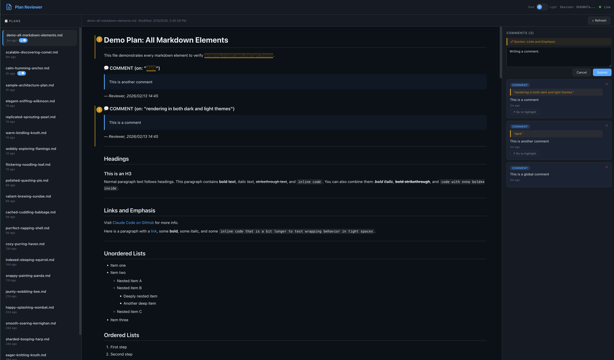

# Plan Viewer

[](https://opensource.org/licenses/MIT)
[](https://tauri.app/)
[](https://www.rust-lang.org/)
[](https://nodejs.org/)

**English | [简体中文](README.md)**

A Tauri desktop application for Claude Code plans — view, annotate, and comment on plans with native file access and live Mermaid diagram rendering.



---

## Table of Contents

- [Features](#features)
- [How It Works](#how-it-works)
- [Quick Start](#quick-start)
- [Usage Guide](#usage-guide)
- [Architecture](#architecture)
- [Configuration](#configuration)
- [Development](#development)
- [Limitations](#limitations)
- [Acknowledgments](#acknowledgments)
- [License](#license)

---

## Features

### Core Capabilities

- **Native Desktop App** — Built with Tauri 2.0 and Rust backend, lightweight and efficient
- **Direct File Access** — Native file system access without HTTP server
- **Real-time File Watcher** — Auto-updates when plan files change (using `notify` crate)

### Markdown Rendering

- **Live Mermaid Rendering** — Supports flowcharts, sequence diagrams, Gantt charts, class diagrams, ER diagrams, and more
- **Syntax Highlighting** — Code blocks highlighted via highlight.js, theme-aware
- **GitHub-flavored Markdown** — Compatible with GitHub Markdown syntax

### Comment System

- **Section Comments** — Click the `+` button next to any heading to add comments
- **Text Selection Comments** — Select any text to add inline comments with context
- **Comment Highlighting** — Selected text with comments is highlighted
- **Comment Sidebar** — Displays comments with linked context previews
- **Bidirectional Sync** — JSON metadata and markdown blocks kept in sync

### User Experience

- **Dark / Light Themes** — Smooth transitions, persisted in localStorage
- **Responsive Layout** — Adapts to different screen sizes
- **Keyboard Shortcuts** — `Ctrl/Cmd + Enter` to submit comments, `Esc` to cancel

---

## How It Works

```
┌──────────────────┐     ┌──────────────────┐     ┌──────────────────┐
│                  │     │                  │     │                  │
│   Claude Code    │────▶│   Plan Viewer    │◀────│   Desktop App    │
│   (Terminal)     │     │   (Tauri/Rust)   │     │   (WebView2)     │
│                  │     │                  │     │                  │
│  Creates/updates │     │  Direct file     │     │  View plans      │
│  plan .md files  │     │  access via Rust │     │  Add comments    │
│  Reads comments  │     │  File watcher    │     │  Mermaid render  │
│  Revises plans   │     │  Native events   │     │                  │
│                  │     │                  │     │                  │
└──────────────────┘     └──────────────────┘     └──────────────────┘
```

### The Review Loop

1. **Claude Code** creates a plan in `~/.claude/plans/` (use plan mode: `Shift+Tab`)
2. **Plan Viewer** auto-detects the file and renders it with Mermaid diagrams
3. **You** review the plan — click section `+` buttons for section-level comments, or select text for inline comments
4. Comments are **written back into the plan `.md` file** under a `## 📝 Review Comments` section
5. **Claude Code** reads the updated plan (it re-reads plan files), sees your comments, and revises accordingly
6. Tell Claude: *"Check the plan file for review comments and address them"*

---

## Quick Start

### Prerequisites

| Dependency | Version | Installation |
|------------|---------|--------------|
| Node.js | LTS | [Download](https://nodejs.org/) |
| pnpm | Latest | `npm install -g pnpm` |
| Rust | 1.70+ | [Install via rustup](https://rustup.rs/) |

#### Platform-specific Requirements

**Windows:**
- [Visual Studio C++ Build Tools](https://visualstudio.microsoft.com/visual-cpp-build-tools/) (Desktop development with C++ workload)

**Linux (Debian/Ubuntu):**
```bash
sudo apt install libwebkit2gtk-4.1-dev build-essential libssl-dev libgtk-3-dev libayatana-appindicator3-dev librsvg2-dev
```

**macOS:**
- Xcode Command Line Tools: `xcode-select --install`

### Installation

#### Using `just` (Recommended)

After [installing `just`](https://github.com/casey/just#installation):

```bash
# Clone the repository
git clone https://github.com/mekalz/plan_viewer.git
cd plan_viewer

# Install dependencies and start
just install-deps
just tauri-dev
```

#### Manual Installation

```bash
# Clone the repository
git clone https://github.com/mekalz/plan_viewer.git
cd plan_viewer

# Install dependencies
pnpm install

# Start development mode
pnpm tauri dev
```

---

## Usage Guide

### Typical Workflow

```bash
# Terminal 1: Start Plan Viewer
cd plan_viewer
pnpm tauri dev

# Terminal 2: Start Claude Code in plan mode
cd your-project
claude
# Press Shift+Tab to switch to plan mode
# Ask: "Create an architecture plan for the auth system"

# Review the plan in the desktop app, add comments
# Back in Terminal 2:
# Tell Claude: "Read the review comments in the plan file and revise"
```

### Comment Format

**Section-level Comment:**

```markdown
---

## 📝 Review Comments

### 💬 COMMENT (re: "Database Design")

> Consider using a composite index on (user_id, created_at)
> for the sessions table to optimize timeline queries.

_— Reviewer, 2026/01/15 15:30_
```

**Inline Comment:**

```markdown
### 💬 COMMENT (on: "JWT-based session management")

> Have we considered token revocation strategies for compromised tokens?

_— Reviewer, 2026/01/15 15:35_
```

### Comment Types

| Type | Icon | Usage |
|------|------|-------|
| `comment` | 💬 | General comment |
| `suggestion` | 💡 | Improvement suggestion |
| `question` | ❓ | Question or clarification needed |
| `approve` | ✅ | Approval/acceptance |
| `reject` | ❌ | Rejection/needs revision |

---

## Architecture

```
plan_viewer/
├── src/                   # Frontend (Vite + Vanilla JS)
│   ├── main.js            # Entry point
│   ├── app.js             # Application logic
│   └── styles/
│       └── main.css       # Styles
│
├── src-tauri/             # Tauri (Rust) backend
│   ├── src/
│   │   └── main.rs        # Rust core logic
│   ├── icons/             # Application icons
│   ├── Cargo.toml         # Rust dependencies
│   └── tauri.conf.json    # Tauri configuration
│
├── docs/                  # VitePress documentation site
│   ├── guide/             # User guides
│   ├── features/          # Feature documentation
│   └── development/       # Development docs
│
├── index.html             # Development HTML entry
├── package.json           # Node.js dependencies
├── vite.config.js         # Vite configuration
├── justfile               # Just command definitions
└── LICENSE                # MIT License
```

### Tauri Command API

| Command | Description |
|---------|-------------|
| `get_plans` | List all plans with metadata |
| `get_plan_by_id` | Get plan content and comments |
| `add_comment_command` | Add a comment to a plan |
| `delete_comment_command` | Delete a comment |

---

## Configuration

### Window Settings

Edit `src-tauri/tauri.conf.json`:

```json
{
  "app": {
    "windows": [{
      "title": "Plan Viewer",
      "width": 1400,
      "height": 900,
      "minWidth": 800,
      "minHeight": 600
    }]
  }
}
```

### Application Info

```json
{
  "productName": "Plan Viewer",
  "version": "1.0.0",
  "identifier": "com.plan-viewer.app"
}
```

---

## Development

### Available Commands

| Command | Description |
|---------|-------------|
| `just tauri-dev` | Start Tauri development mode |
| `just tauri-build` | Build production release |
| `just tauri-build-debug` | Build debug release |
| `just vite-dev` | Start Vite dev server (frontend only) |
| `just docs-dev` | Start documentation dev server |
| `just docs-build` | Build documentation site |
| `just ci` | Run all CI checks |
| `just clean` | Clean build artifacts |

### Build for Release

```bash
# Production build
just tauri-build

# Output locations
# Windows: src-tauri/target/release/bundle/msi/
#          src-tauri/target/release/bundle/nsis/
# macOS:   src-tauri/target/release/bundle/dmg/
# Linux:   src-tauri/target/release/bundle/deb/
#          src-tauri/target/release/bundle/appimage/
```

---

## Limitations

- Comments are appended to plan files — the file grows over multiple review rounds
- No authentication (desktop app only)
- Mermaid rendering depends on CDN availability
- Claude Code needs to be told to re-read the plan file for comments

---

## Acknowledgments

This project was inspired by and references the following resources:

- **[plan_viewer](https://github.com/mekalz/plan_viewer)** — Provided the core design concepts for the Claude Code plan file viewer, including:
  - Bidirectional sync mechanism between plan files and comments
  - Live Mermaid diagram rendering solution
  - Interaction design for section-level and inline comments
  - Comment format specification for writing to Markdown files

---

## License

[MIT License](LICENSE) © 2026 Plan Viewer Contributors
