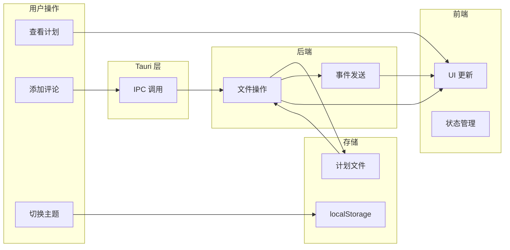
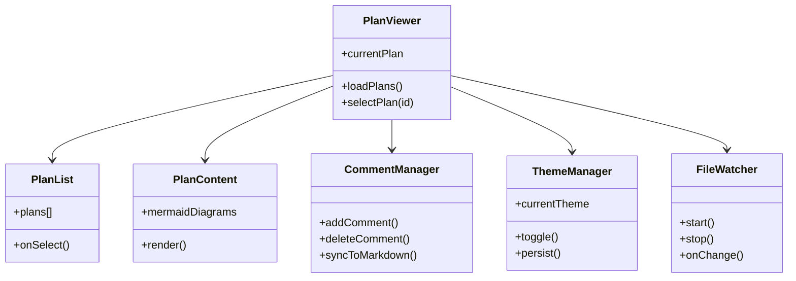

# 项目结构

深入了解 Plan Viewer 的项目架构。

## 目录结构

```
plan-viewer/
├── src/                       # 前端源码
│   ├── index.html             # 主 HTML 模板
│   ├── main.js                # 应用入口点
│   ├── app.js                 # 核心应用逻辑
│   └── styles/
│       └── main.css           # 全局样式
│
├── src-tauri/                 # Tauri 后端
│   ├── src/
│   │   └── main.rs            # Rust 主程序
│   ├── gen/                   # 生成的模式文件
│   │   └── schemas/
│   ├── icons/                 # 应用图标
│   │   ├── icon.svg
│   │   ├── icon.ico           # Windows
│   │   └── icon-*.png         # 各尺寸 PNG
│   ├── Cargo.toml             # Rust 依赖配置
│   ├── Cargo.lock             # 依赖锁定文件
│   ├── build.rs               # 构建脚本
│   └── tauri.conf.json        # Tauri 配置
│
├── docs/                      # VitePress 文档
│   ├── .vitepress/
│   │   ├── config.mts         # 文档配置
│   │   └── theme/             # 自定义主题
│   ├── public/
│   │   └── images/            # 图片资源
│   ├── features/              # 功能文档
│   ├── guide/                 # 使用指南
│   ├── development/           # 开发文档
│   └── index.md               # 文档首页
│
├── package.json               # Node.js 配置
├── pnpm-lock.yaml             # 依赖锁定
├── vite.config.js             # Vite 配置
├── justfile                   # Just 命令定义
├── icon.svg                   # 项目 Logo
├── plan_viewer.md             # Claude Code 审阅说明
├── README.md                  # 项目说明
├── CONTRIBUTING.md            # 贡献指南
└── LICENSE                    # MIT 许可证
```

## 核心模块

### 前端模块 (src/)

#### main.js

应用入口点，负责：

- 初始化 Tauri API
- 设置事件监听器
- 启动应用

#### app.js

核心应用逻辑，包含：

- 计划加载和渲染
- 评论系统管理
- 主题切换
- Mermaid 图表渲染

#### main.css

全局样式定义：

- CSS 变量（主题）
- 布局样式
- 组件样式
- 响应式设计

### 后端模块 (src-tauri/src/main.rs)

Rust 后端实现：

- 文件系统操作
- 文件监听
- 评论管理
- IPC 命令处理

## 数据流



## 组件关系



## 配置文件说明

### package.json

```json
{
  "name": "plan-viewer",
  "scripts": {
    "dev": "vite",
    "build": "vite build",
    "preview": "vite preview",
    "tauri": "tauri",
    "docs:dev": "vitepress dev docs",
    "docs:build": "vitepress build docs",
    "docs:preview": "vitepress preview docs"
  }
}
```

### vite.config.js

```javascript
import { defineConfig } from 'vite'

export default defineConfig({
  clearScreen: false,
  server: {
    port: 5173,
    strictPort: true
  },
  build: {
    target: ['es2021', 'chrome100', 'safari13'],
    minify: !process.env.TAURI_DEBUG ? 'esbuild' : false,
    sourcemap: !!process.env.TAURI_DEBUG
  }
})
```

### justfile

```just
# 安装依赖
install-deps:
    pnpm install

# 启动开发模式
tauri-dev:
    pnpm tauri dev

# 构建生产版本
tauri-build:
    pnpm tauri build

# 构建调试版本
tauri-build-debug:
    pnpm tauri build --debug
```

## 扩展指南

### 添加新的 Tauri 命令

1. 在 `main.rs` 中定义命令：

```rust
#[tauri::command]
fn my_new_command(param: &str) -> Result<String, String> {
    Ok(format!("Received: {}", param))
}
```

2. 注册命令：

```rust
fn main() {
    tauri::Builder::default()
        .invoke_handler(tauri::generate_handler![
            my_new_command
        ])
        .run(tauri::generate_context!())
        .expect("error while running tauri application");
}
```

3. 前端调用：

```javascript
import { invoke } from '@tauri-apps/api/core';

const result = await invoke('my_new_command', { param: 'test' });
```

### 添加新的 UI 组件

1. 在 `src/` 中创建组件逻辑
2. 在 `index.html` 中添加 HTML 结构
3. 在 `main.css` 中添加样式
4. 在 `app.js` 中集成组件
