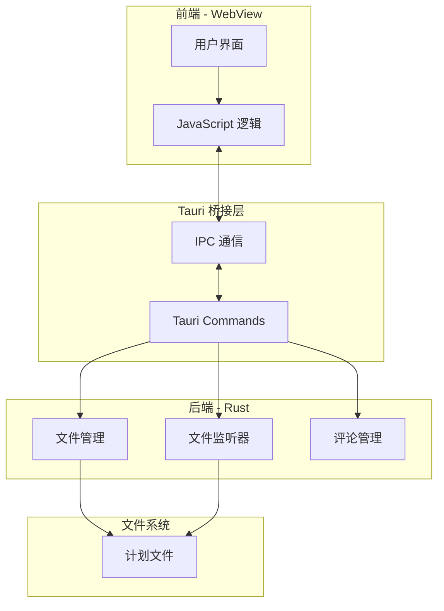

# Tauri 开发

深入了解 Plan Viewer 的 Tauri 后端开发。

## Tauri 架构



## Tauri Commands

### 获取计划列表

```rust
#[tauri::command]
fn get_plans() -> Result<Vec<PlanInfo>, String> {
    // 返回所有计划的元数据
}
```

### 获取计划内容

```rust
#[tauri::command]
fn get_plan_by_id(id: &str) -> Result<PlanContent, String> {
    // 返回指定计划的内容和评论
}
```

### 添加评论

```rust
#[tauri::command]
fn add_comment_command(
    plan_id: &str,
    comment: Comment,
) -> Result<(), String> {
    // 向计划添加评论
}
```

### 删除评论

```rust
#[tauri::command]
fn delete_comment_command(
    plan_id: &str,
    comment_id: &str,
) -> Result<(), String> {
    // 从计划删除评论
}
```

## 文件监听

使用 `notify` crate 实现文件监听：

```rust
use notify::{Watcher, RecursiveMode, watcher};
use std::sync::mpsc::channel;

fn start_watcher(path: &Path) -> Result<()> {
    let (tx, rx) = channel();
    let mut watcher = watcher(tx, Duration::from_millis(100))?;
    
    watcher.watch(path, RecursiveMode::Recursive)?;
    
    // 处理文件变更事件
    loop {
        match rx.recv() {
            Ok(event) => handle_file_event(event),
            Err(e) => error!("Watch error: {:?}", e),
        }
    }
}
```

## 事件系统

### 发送事件到前端

```rust
app_handle.emit_all("plan-updated", payload)?;
```

### 前端监听事件

```javascript
import { listen } from '@tauri-apps/api/event';

listen('plan-updated', (event) => {
    console.log('Plan updated:', event.payload);
});
```

## 配置文件

### tauri.conf.json

```json
{
  "productName": "Plan Viewer",
  "version": "1.0.0",
  "identifier": "com.plan-viewer.app",
  "build": {
    "beforeDevCommand": "pnpm dev",
    "devUrl": "http://localhost:5173",
    "beforeBuildCommand": "pnpm build",
    "frontendDist": "../dist"
  },
  "app": {
    "windows": [
      {
        "title": "Plan Viewer",
        "width": 1200,
        "height": 800,
        "resizable": true,
        "fullscreen": false
      }
    ],
    "security": {
      "csp": null
    }
  }
}
```

### Cargo.toml

```toml
[package]
name = "plan-viewer"
version = "1.0.0"
edition = "2021"

[dependencies]
tauri = { version = "2.0", features = ["devtools"] }
serde = { version = "1.0", features = ["derive"] }
serde_json = "1.0"
notify = "6.0"
dirs = "5.0"
chrono = "0.4"

[build-dependencies]
tauri-build = { version = "2.0", features = [] }
```

## 调试技巧

### 启用开发者工具

在开发模式下按 `F12` 打开开发者工具。

### Rust 日志

使用 `println!` 或 `log` crate 输出调试信息：

```rust
println!("Debug: {:?}", some_value);
```

### 前端调试

在 JavaScript 中使用 `console.log`：

```javascript
console.log('Debug:', someValue);
```

## 构建发布

### 开发构建

```bash
pnpm tauri build --debug
```

### 生产构建

```bash
pnpm tauri build
```

构建产物位于 `src-tauri/target/release/bundle/`：

- Windows: `.msi` 和 `.exe` (NSIS)
- macOS: `.dmg` 和 `.app`
- Linux: `.deb` 和 `.AppImage`

## 性能优化

### 减小包体积

1. 启用 LTO (Link Time Optimization)
2. 使用 `strip` 移除符号
3. 优化依赖

```toml
[profile.release]
lto = true
strip = true
opt-level = "z"
```

### 启动优化

1. 延迟加载非关键资源
2. 预编译前端资源
3. 使用系统 WebView
