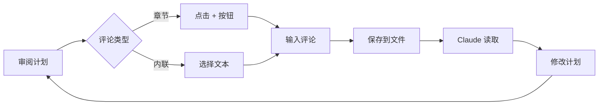

# 评论系统

Plan Viewer 提供了强大的评论系统，支持两种评论方式：章节级评论和文本选择内联评论。

## 评论类型

### 章节级评论

点击任意标题旁边的 `+` 按钮，可以为整个章节添加评论。

评论会以以下格式添加到计划文件中：

```markdown
---

## 📝 Review Comments

### 💬 COMMENT (re: "Database Design")

> Consider using a composite index on (user_id, created_at)
> for the sessions table to optimize timeline queries.

_— Reviewer, 2026/01/15 15:30_
```

### 内联评论

选择任意文本后，可以添加针对该文本的内联评论：

```markdown
### 💬 COMMENT (on: "JWT-based session management")

> Have we considered token revocation strategies for compromised tokens?

_— Reviewer, 2026/01/15 15:35_
```

## 评论工作流



## 评论功能特性

### 评论高亮

被选中的带有评论的文本会被高亮显示，方便快速定位评论位置。

### 评论侧边栏

评论会显示在侧边栏中，包含：

- 评论内容预览
- 关联的上下文
- 时间戳信息

### 双向同步

评论系统维护 JSON 元数据和 Markdown 块的双向同步：

- UI 中的评论操作会同步到 Markdown
- 直接编辑 Markdown 中的评论也会反映到 UI

## Claude Code 集成

### 如何让 Claude 读取评论

在 Claude Code 中，告诉 Claude：

> 检查计划文件中的审阅评论并处理它们

Claude Code 会重新读取计划文件，看到你的评论，并进行相应的修改。

### Claude 的回复格式

当 Claude 处理完评论后，会在评论下方添加回复：

```markdown
**Claude's Response**: Good point. Updated the Database Design section
to use a composite index. This should improve query performance for the
user timeline queries.
```

## 最佳实践

::: tip 清晰的评论
评论应该清晰、具体，说明期望的修改方向。
:::

::: tip 一次处理
建议在 Claude 处理完所有评论后再添加新评论，避免评论堆积。
:::

::: warning 评论累积
评论会追加到计划文件中，多轮审阅后文件会增长。定期清理已处理的评论。
:::
