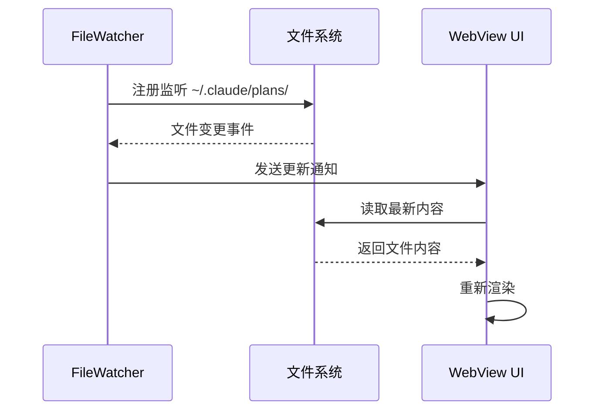

# 文件监听

Plan Viewer 使用 Rust 的 `notify` crate 实现文件监听功能，实时检测计划文件的变化。

## 工作原理



## 核心功能

### 实时更新

当 Claude Code 创建或修改计划文件时，Plan Viewer 会自动：

1. 检测文件变更
2. 重新读取文件内容
3. 更新 UI 显示
4. 重新渲染 Mermaid 图表

### 自动重连

如果文件监听意外断开，系统会自动尝试重新连接：

- 指数退避重试策略
- 最大重试次数限制
- 错误日志记录

### 性能优化

- **防抖处理**: 快速连续变更会被合并处理
- **增量更新**: 仅更新变化的部分
- **资源清理**: 关闭计划时释放监听资源

## Tauri 命令

文件监听通过以下 Tauri 命令实现：

| 命令 | 描述 |
|------|------|
| `get_plans` | 获取所有计划列表及元数据 |
| `get_plan_by_id` | 根据 ID 获取计划内容和评论 |
| `start_watcher` | 启动文件监听 |
| `stop_watcher` | 停止文件监听 |

## 配置选项

可以在 `src-tauri/src/main.rs` 中调整监听配置：

```rust
// 监听配置
const WATCH_PATH: &str = ".claude/plans";
const DEBOUNCE_MS: u64 = 100;
const MAX_RETRIES: u32 = 5;
```

## 故障排除

### 文件监听不工作

::: details 检查清单
1. 确认 `~/.claude/plans/` 目录存在
2. 检查文件权限
3. 查看控制台错误日志
4. 尝试重启应用
:::

### 高 CPU 占用

::: details 可能原因
- 监听的目录文件过多
- 文件变更过于频繁
- 防抖时间设置过短
:::

## 平台差异

| 平台 | 实现方式 | 注意事项 |
|------|----------|----------|
| Windows | ReadDirectoryChangesW | 支持 UNC 路径 |
| macOS | FSEvents | 支持网络卷 |
| Linux | inotify | 需要调整 inotify 限制 |
