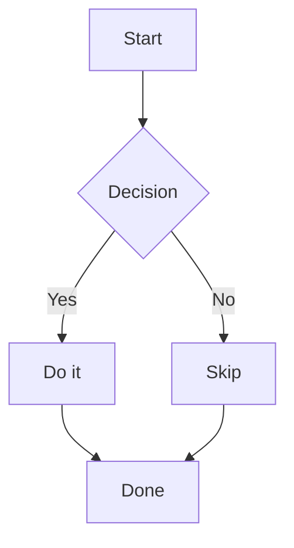
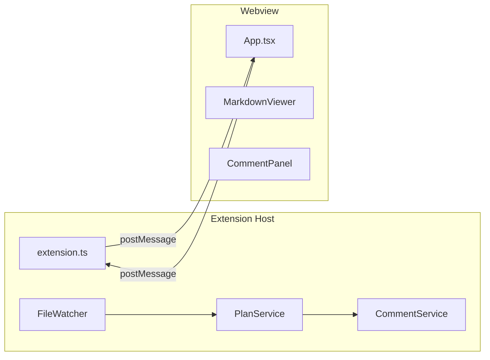

# Mermaid Diagrams

Plan Viewer renders [Mermaid](https://mermaid.js.org/) diagrams embedded in plan files, with automatic adaptation to VS Code's current color theme.

## How It Works

Any fenced code block with the language identifier `mermaid` is rendered as a diagram:

````markdown

````

The block is replaced by an interactive SVG rendered by the Mermaid library.

## Supported Diagram Types

All diagram types supported by Mermaid 11 are available:

| Type | Syntax keyword |
|---|---|
| Flowchart | `flowchart` / `graph` |
| Sequence | `sequenceDiagram` |
| Class | `classDiagram` |
| State | `stateDiagram-v2` |
| Entity-Relationship | `erDiagram` |
| Gantt | `gantt` |
| Pie | `pie` |
| Git graph | `gitGraph` |
| Mindmap | `mindmap` |
| Timeline | `timeline` |

## Theme Integration

Mermaid automatically uses a theme that matches VS Code's active color theme:

- **Dark theme active** → Mermaid renders with `dark` theme (light text on dark background)
- **Light theme active** → Mermaid renders with `default` theme (dark text on light background)

The theme is detected at render time and updates if you switch VS Code themes while the webview is open.

## Lazy Loading

Mermaid is loaded on demand — it is not bundled into the main webview script. This keeps the initial load fast even for plans without diagrams.

The library loads the first time a Mermaid block scrolls into the viewport. If a diagram appears as a plain code block briefly, this is expected behavior while Mermaid initialises.

## Example: Plan Architecture

A typical plan might include an architecture diagram like this:

````markdown

````

## Troubleshooting

**Diagram shows as a plain code block**

- Wait 1–2 seconds for lazy loading to complete
- Scroll the diagram into view to trigger the viewport-based loader
- Check diagram syntax in the [Mermaid Live Editor](https://mermaid.live)
- Open VS Code Developer Tools (`Help → Toggle Developer Tools`) and check the Console tab for errors
