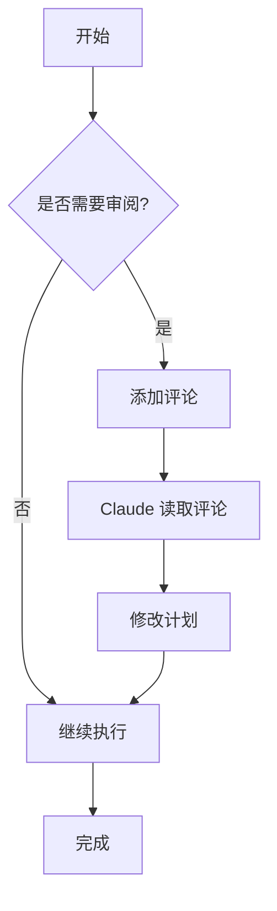
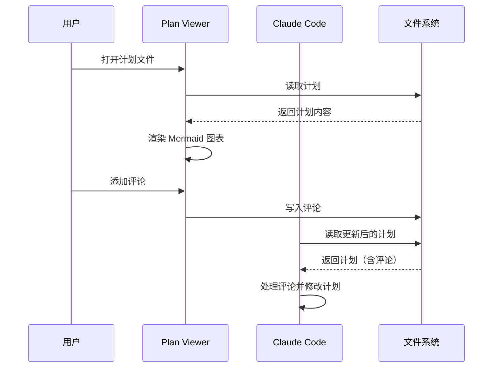
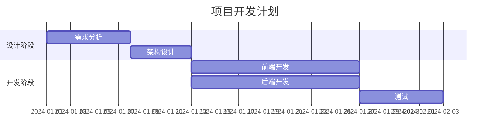
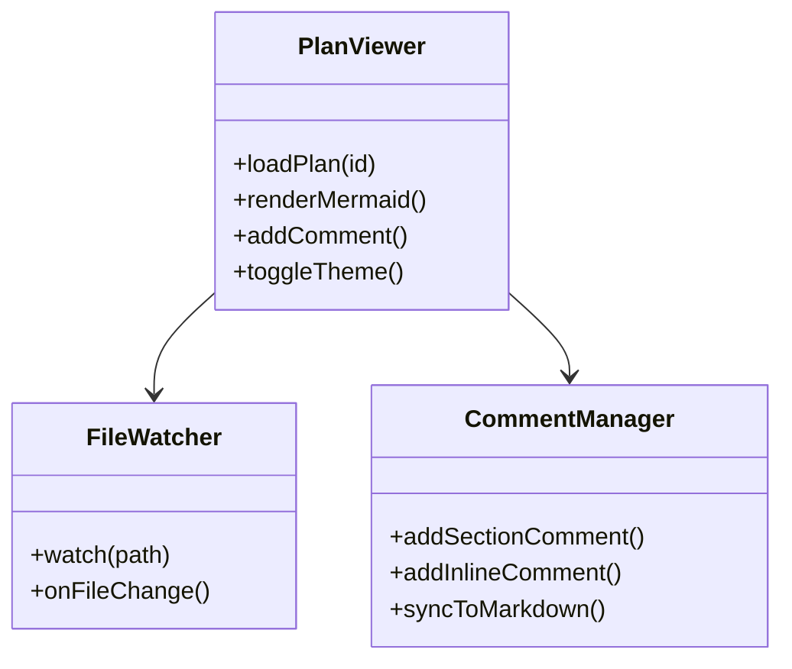
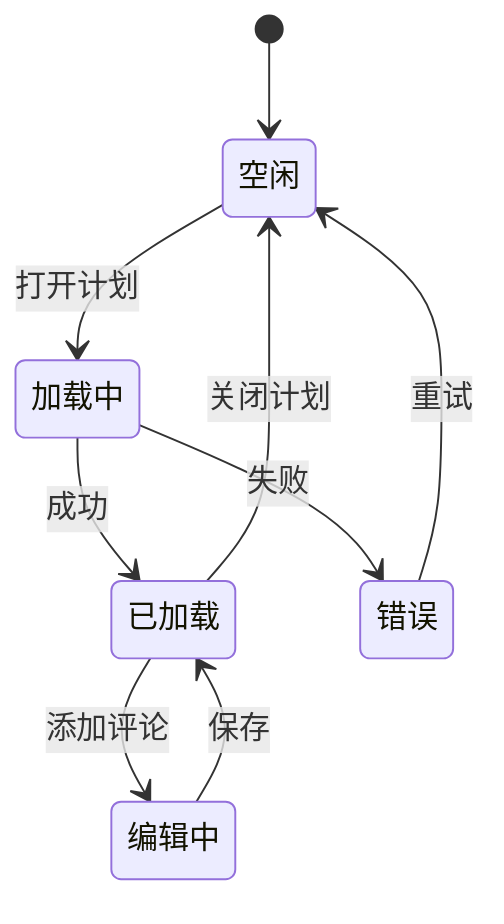

# Mermaid 图表渲染

Plan Viewer 内置 Mermaid 图表渲染支持，可以将计划中的 Mermaid 代码块实时渲染为可视化图表。

## 支持的图表类型

### 流程图 (Flowchart)

### 时序图 (Sequence Diagram)

### 甘特图 (Gantt Chart)

### 类图 (Class Diagram)

### 状态图 (State Diagram)

## 渲染机制

Plan Viewer 通过 CDN 加载 Mermaid 库进行图表渲染：

1. 检测 Markdown 中的 `mermaid` 代码块
2. 异步加载 Mermaid 库
3. 根据当前主题选择配色方案
4. 渲染 SVG 图表并插入文档

## 性能优化

- **懒加载**: Mermaid 库仅在需要时加载
- **缓存**: 已渲染的图表会被缓存
- **主题适配**: 图表颜色自动适配当前主题

## 注意事项

::: warning CDN 依赖
Mermaid 渲染依赖 CDN 可用性。如果 CDN 不可用，图表将显示为代码块。
:::

::: tip 离线使用
如需离线使用，可以考虑将 Mermaid 库本地化部署。
:::
