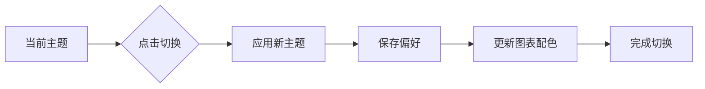

# 主题切换

Plan Viewer 支持深色和浅色两种主题，并提供平滑的切换动画。

## 主题特性

### 深色主题

适合夜间使用或偏好深色界面的用户：

- 深色背景减少眼睛疲劳
- 优化的对比度确保可读性
- Mermaid 图表自动适配深色配色

### 浅色主题

适合日间使用或偏好传统界面的用户：

- 明亮的背景提供清晰视野
- 专业的配色方案
- 所有元素完美适配

## 切换方式

点击界面右上角的主题切换按钮即可在深色和浅色主题之间切换。



## 持久化存储

主题偏好会自动保存到 `localStorage`，下次打开应用时会自动应用上次选择的主题。

## 代码高亮适配

代码块的语法高亮会根据当前主题自动调整：

- **浅色主题**: 使用明亮的高亮配色
- **深色主题**: 使用暗色高亮配色

## CSS 变量

主题使用 CSS 变量实现，方便自定义：

```css
:root {
  --bg-color: #ffffff;
  --text-color: #333333;
  --accent-color: #7c3aed;
}

.dark {
  --bg-color: #1a1a2e;
  --text-color: #e0e0e0;
  --accent-color: #a78bfa;
}
```

## 自定义主题

如果需要自定义主题颜色，可以修改 `src/styles/main.css` 中的 CSS 变量。

::: tip 主题建议
建议保持足够的对比度，确保所有用户都能舒适阅读。
:::
