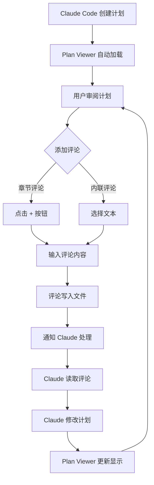

# 评论工作流

掌握 Plan Viewer 的评论系统，实现高效的计划审阅。

## 完整工作流



## 典型会话示例

### 终端 1: 启动 Plan Viewer

```powershell
cd plan-viewer
pnpm tauri dev
```

### 终端 2: 使用 Claude Code

```powershell
cd my-project
claude
# 按 Shift+Tab 切换到计划模式
# 提问: "为认证系统创建架构计划"
```

### 审阅和迭代

1. 在 Plan Viewer 中查看生成的计划
2. 添加评论指出需要改进的地方
3. 回到终端 2，告诉 Claude：
   > 检查计划文件中的审阅评论并处理它们
4. Claude 会读取评论并修改计划
5. Plan Viewer 自动显示更新后的计划
6. 重复步骤 2-5 直到满意

## 评论格式详解

### 章节评论格式

```markdown
---

## 📝 Review Comments

### 💬 COMMENT (re: "Section Title")

> Your feedback here.

_— Reviewer, YYYY/MM/DD HH:MM_
```

### 内联评论格式

```markdown
### 💬 COMMENT (on: "selected text snippet")

> Your inline feedback here.

_— Reviewer, YYYY/MM/DD HH:MM_
```

### Claude 回复格式

```markdown
**Claude's Response**: Your response addressing the feedback.
```

## 最佳实践

### 撰写有效评论

::: tip 具体明确
❌ "这部分需要改进"
✅ "建议在 sessions 表添加 (user_id, created_at) 复合索引以优化时间线查询"
:::

::: tip 提供上下文
❌ "为什么要用 JWT？"
✅ "考虑到需要支持移动端离线访问，JWT 是否是最佳选择？是否考虑过 session + refresh token 方案？"
:::

::: tip 一次一个主题
每条评论聚焦一个具体问题，便于 Claude 逐个处理。
:::

### 迭代策略

1. **第一轮**: 关注整体架构和设计方向
2. **第二轮**: 深入细节，检查边界条件
3. **第三轮**: 确认实现细节和代码规范

### 评论管理

- 定期清理已处理的评论
- 使用清晰的评论标题
- 保持评论的可追溯性

## 常见场景

### 场景 1: 架构审阅

```markdown
### 💬 COMMENT (re: "Database Design")

> 建议添加读写分离设计，主库处理写操作，从库处理读操作。
> 预期读流量是写流量的 10 倍，这样可以显著提升性能。

_— Reviewer, 2026/01/15 10:30_
```

### 场景 2: 安全审查

```markdown
### 💬 COMMENT (on: "用户密码直接存储")

> ⚠️ 安全问题：密码不能明文存储。请使用 bcrypt 或 argon2 进行哈希处理。

_— Reviewer, 2026/01/15 10:35_
```

### 场景 3: 性能建议

```markdown
### 💬 COMMENT (re: "API Design")

> 建议为列表 API 添加分页支持，默认每页 20 条。
> 考虑添加 cursor-based pagination 以支持无限滚动场景。

_— Reviewer, 2026/01/15 10:40_
```

## 故障排除

### 评论未显示

1. 检查文件是否正确保存
2. 刷新 Plan Viewer
3. 检查 Markdown 格式是否正确

### Claude 未读取评论

明确告诉 Claude 读取评论：

> 请读取 ~/.claude/plans/plan-xxx.md 文件中的审阅评论，并逐一处理。
