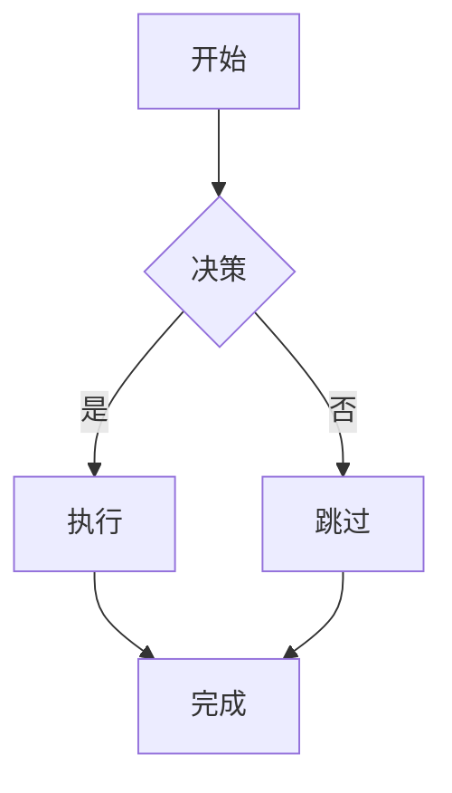
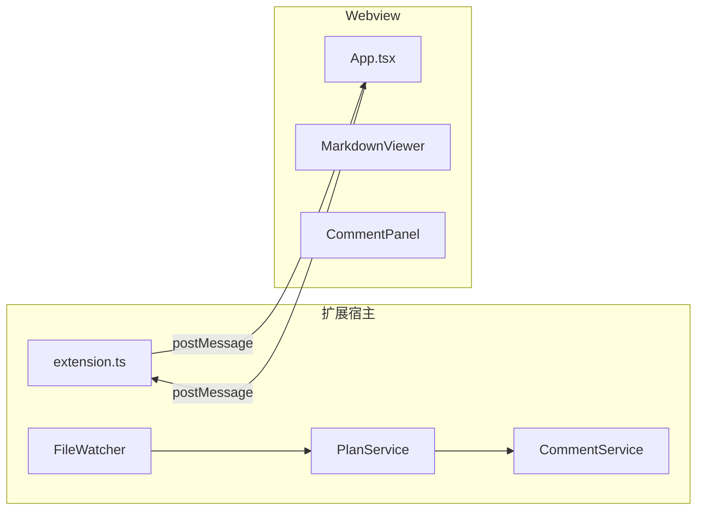

# Mermaid 图表

Plan Viewer 渲染计划文件中嵌入的 [Mermaid](https://mermaid.js.org/) 图表，并自动适配 VS Code 当前的配色主题。

## 工作原理

任何使用语言标识符 `mermaid` 的围栏代码块都会被渲染为图表：

````markdown

````

该代码块会被替换为由 Mermaid 库渲染的交互式 SVG。

## 支持的图表类型

所有 Mermaid 11 支持的图表类型均可使用：

| 类型 | 语法关键字 |
|---|---|
| 流程图 | `flowchart` / `graph` |
| 时序图 | `sequenceDiagram` |
| 类图 | `classDiagram` |
| 状态图 | `stateDiagram-v2` |
| 实体关系图 | `erDiagram` |
| 甘特图 | `gantt` |
| 饼图 | `pie` |
| Git 图 | `gitGraph` |
| 思维导图 | `mindmap` |
| 时间线 | `timeline` |

## 主题集成

Mermaid 会自动使用与 VS Code 当前配色主题匹配的风格：

- **深色主题** → Mermaid 使用 `dark` 主题（深色背景上的浅色文字）
- **浅色主题** → Mermaid 使用 `default` 主题（浅色背景上的深色文字）

主题在渲染时检测，若你在 Webview 打开时切换了 VS Code 主题，图表会随之更新。

## 懒加载

Mermaid 按需加载——它不打包在主 Webview 脚本中，这样即使计划中没有图表，初始加载也很快。

该库在第一个 Mermaid 块滚动进入视口时加载。若图表短暂显示为纯代码块，这是 Mermaid 初始化期间的正常现象。

## 示例：计划架构图

典型的计划可能包含这样的架构图：

````markdown

````

## 故障排查

**图表显示为纯代码块**

- 等待 1–2 秒，让懒加载完成
- 将图表滚动到可见区域以触发视口加载器
- 使用 [Mermaid Live Editor](https://mermaid.live) 检查图表语法
- 打开 VS Code 开发者工具（`帮助 → 切换开发者工具`），在控制台标签页中检查错误
